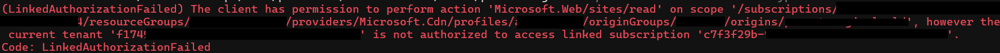

# Introduction

One of the features of private link is the ability to privately access resources within Azure. The most common scenario is the creation of Private Endpoints for securing access to a PaaS resources like Azure App Service. However, there are other scenarios possible, like for instance extending your own services. For instance, as a Managed Service Provider, you can create a service for your customers and allow customers access to these services using Private Link. This scenario obviously works across Azure Tenants.

Another scenario where Private Link / Private Endpoint can be utilized is for Azure Front Door (AFD). This allows you to securely link AFD to an Azure resource (f.i. App Service, Storage Account, etc). For more information, you can check [AFD - Private Link](https://learn.microsoft.com/en-us/azure/frontdoor/private-link)

However, according to the documentation, this is only possible within the same tenant. Or is it?

**IMPORTANT: The following is provided as thought experiment! Even though it works, Azure Support have confirmed this to be an unsupported scenario. Do not use in production!**

# Attempt 1
The easiest way to try this would be with Az Cli. One of the configuration paths allows you to specify a resourceId for the resource you would like to link to AFD.
For instance, something like:

```PowerShell
az afd origin create `
  --enabled-state Enabled `
  --resource-group myRsg `
  --origin-group-name origin1 `
  --origin-name originName1 `
  --profile-name myAfd01 `
  --host-name somehostname.swedencentral-01.azurewebsites.net `
  --origin-host-header somehostname.swedencentral-01.azurewebsites.net `
  --http-port 80 `
  --https-port 443 `
  --priority 1 `
  --weight 500 `
  --enable-private-link true `
  --private-link-location SwedenCentral `
  --private-link-request-message 'AFD app service origin Private Link request.' `
  --private-link-resource /subscriptions/00000000-0000-0000-0000-000000000000/resourceGroups/test/providers/Microsoft.Web/sites/someAppService `
  --private-link-sub-resource-type sites
```

Sadly, this does not quite work:


# Attempt 2
Ok, so maybe we can make it a little harder on ourselves. Let's see if we can do this through a REST api call. In some scenarios (and even with some Az Cli commands (group?)) it is possible to use an [auxiliary token](https://learn.microsoft.com/en-us/azure/azure-resource-manager/management/authenticate-multi-tenant) in a call. This could allow us to provide authentication across both tenants.

_Regards to [Journey of the Geek](https://journeyofthegeek.com/2025/03/06/deploying-resources-across-multiple-azure-tenants/) for giving me the idea and doing the hard work of figuring it out._

When creating a rest call with 'az rest' a bearer token is included for the tenant that is within the current context. However, we can save a token for another tenant and supply this as an auxiliary token. To do this, using Az Cli, you could follow the steps below (from PowerShell):

```PowerShell
az login -t tenantB
$auxiliaryToken=$(az account get-access-token --resource=https://management.azure.com/ --tenant tenantB --query accessToken -o tsv)
az login -t tenantA

# Create Origin Group
$body = @"
{
  "properties": {
    "loadBalancingSettings": {
      "sampleSize": 3,
      "successfulSamplesRequired": 3,
      "additionalLatencyInMilliseconds": 1000
    },
    "healthProbeSettings": {
      "probePath": "/path2",
      "probeRequestType": "NotSet",
      "probeProtocol": "NotSet",
      "probeIntervalInSeconds": 10
    },
    "trafficRestorationTimeToHealedOrNewEndpointsInMinutes": 5
  }
}
@"

$body = ($body | ConvertTo-Json -Compress -Depth 9).Replace('"', '\"')
az rest --method put --uri https://management.azure.com/subscriptions/00000000-0000-0000-0000-000000000000/resourceGroups/myRsg/providers/Microsoft.Cdn/profiles/myAfd1/originGroups/origin1?api-version=2025-04-15 --headers "x-ms-authorization-auxiliary=Bearer $auxiliaryToken" --body $body

# Create Origin
$body = @"
{
    "properties": {
        "enabledState": "Enabled",
        "enforceCertificateNameCheck": true,
        "hostName": "someAppService.swedencentral-01.azurewebsites.net",
        "httpPort": 80,
        "httpsPort": 443,
        "originHostHeader": "someAppService.swedencentral-01.azurewebsites.net",
        "priority": 1,
        "sharedPrivateLinkResource": {
            "groupId": "sites",
            "privateLink": {
                "id": "/subscriptions/00000000-0000-0000-0000-000000000000/resourceGroups/test/providers/Microsoft.Web/sites/someAppService"
            },
            "privateLinkLocation": "SwedenCentral",
            "requestMessage": "AFD app service origin Private Link request."
        },
        "weight": 500
    }
}
@"

$body = ($body | ConvertTo-Json -Compress -Depth 9).Replace('"', '\"')
az rest --method put --uri https://management.azure.com/subscriptions/0e59d1ce-9dcb-4e91-b516-0463dc913f94/resourceGroups/rg-ago-test-pw/providers/Microsoft.Cdn/profiles/ago-pw-amg/originGroups/oldSite/origins/pw-automagical-old?api-version=2025-04-15 --headers "x-ms-authorization-auxiliary=Bearer ${auxiliaryToken}" --body $body

```

This deployment works! To make sure privatelink is used, I disabled public access to the App Service and made sure publishing through AFD kept working. 